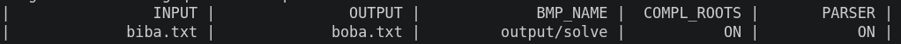
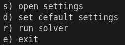
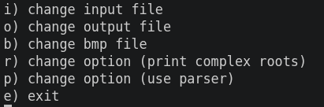
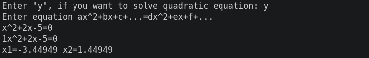
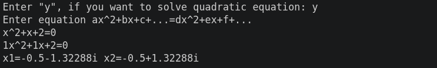
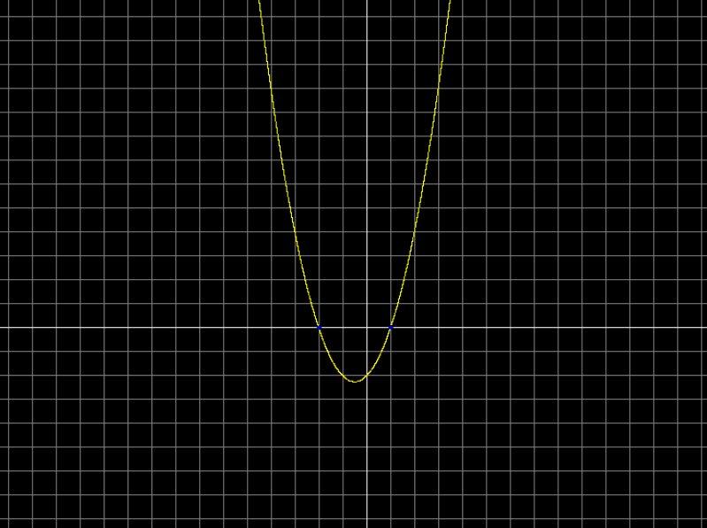

# Square Solver

## Описание

Данная программа предназначена для решения квадратных уравнений \(ax^2 + bx + c = 0\) в действительных и комплексных числах. Программа позволяет вводить уравнение как в виде коэффициентов, так и в виде строки. Кроме того, программа имеет возможность сохранения решений в файл и чтения данных из файла. Также поддерживается вывод комплексных корней и сохранение графиков в BMP-файл.

## Установка

**Платформа:** Ubuntu 22.04+

1. Склонируйте репозиторий:
   ```bash
   git clone https://github.com/nechelovek1/SquareSolver
   ```

2. Перейдите в папку и запустите скрипт компиляции:
   ```bash
   cd SquareSolver
   ./build.sh
   ```

3. Запустите программу:
   ```bash
   ./solver
   ```

## Опции командной строки

| Опция | Описание |
|-------|----------|
| `-h` / `-H` | Показывает памятку по опциям командной строки. |
| `-i` / `-I "имя файла"` | Имя файла ввода. Если не указано, программа использует стандартный поток ввода (с клавиатуры). |
| `-o` / `-O "имя файла"` | Имя файла вывода. Если не указано, программа использует стандартный поток вывода (на экран). |
| `-p` / `-P` | Если указано, программа использует парсинг строки для ввода уравнения. |
| `-r` / `-R` | Если указано, программа отображает комплексные корни. |
| `-d` / `-D "имя файла"` | Имя файла для сохранения графиков уравнений. Сохраняет каждый график в цикле решения в файлы с именами `"имя файла"_"номер уравнения".bmp`. Если не указано, графики не сохраняются. |

## Интерфейс

### Отображение настроек

Здесь отображаются текущие настройки программы:



- **INPUT** — имя файла ввода  
- **OUTPUT** — имя файла вывода  
- **BMP_NAME** — шаблон имён BMP-файлов для сохранения графиков  
- **COMPL_ROOTS** — отображать комплексные корни (ON/OFF)  
- **PARSER** — использовать парсер (ON/OFF)

### Главное меню



- `s` — открыть меню настроек  
- `d` — сбросить настройки по умолчанию:  
  - INPUT: стандартный ввод  
  - OUTPUT: стандартный вывод  
  - BMP_NAME: NO  
  - COMPL_ROOTS: OFF  
  - PARSER: OFF  
- `r` — запустить цикл ввода, решения и вывода уравнений  
- `e` — выйти из программы

### Меню настроек



- `i` — изменить файл для ввода  
- `o` — изменить файл для вывода  
- `b` — изменить шаблон BMP-файлов для сохранения графиков  
- `r` — включить / выключить отображение комплексных корней  
- `p` — включить / выключить парсер  
- `e` — выйти из настроек

### Решение уравнения в действительных числах



### Решение уравнения в комплексных числах



### Отображение графиков в BMP



Синими точками отрисовываются пересечения функции с осью x